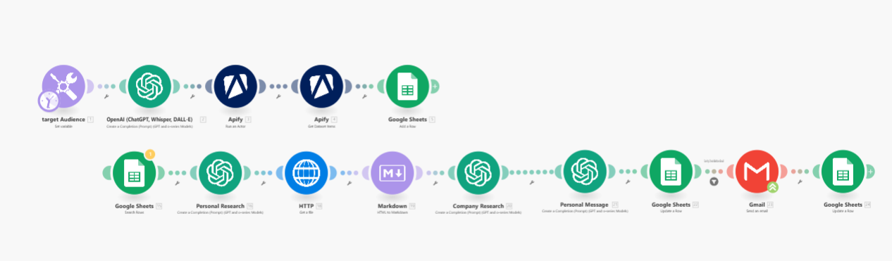
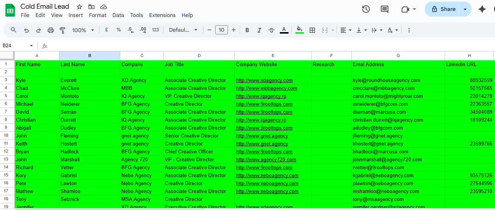

# 📸 Cold Email Lead – Visual System Overview

This folder contains visual documentation of the **Cold Email Lead** automation system — a fully AI-powered cold outreach engine built using GPT-4, Make.com, Google Sheets, and Gmail.

---

## 🔁 Full Automation Flow

This is the complete Make.com scenario. It:
- Loops through each row in Google Sheets
- Runs GPT-4 to generate research and email
- Sends via Gmail or Instantly
- Updates the spreadsheet with status and timestamps

---

## 🧠 GPT Prompt Example (Zoomed View)

Each GPT module takes variables like `{{first_name}}`, `{{job_title}}`, `{{company}}`, and `{{linkedin_url}}` and produces contextual research or personalized emails.

---

## 📊 Google Sheet Tracker Structure

Your Google Sheet is the lead database. It includes:
- Lead contact data
- Research and personalization fields
- `Sent`, `Sent At`, and `Status` columns for automation sync

---

## 🗺️ System Flow Diagram

This diagram outlines the entire Cold Email Lead workflow, from Apollo scraping to final email delivery and lead tracking.

---

## 📄 Sales Page (PDF)

View the client-ready one-pager here:  
📎 [`cold_email_lead_sales_page.pdf`](./cold_email_lead_sales_page.pdf)
